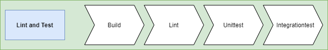
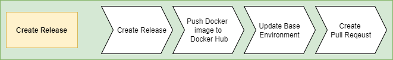

# Workflows

## Lint and Test

Lints and runs both unit and integration tests. 

## Create Release

This workflow creates a new release. This is done by generating a new version number, which is used for creating new Github release and making new Docker image. 

When both the Docker image is pushed to Dockerhub the workflow creates a new branch in [base environment repository](https://github.com/Energinet-DataHub/eo-base-environment) with an updated image version in [eo-auth-service.yaml](https://github.com/Energinet-DataHub/eo-base-environment/tree/development/yggdrasil/applications/eo/eo-auth). A pull-request into the development branch is then made. 

# Workflows Triggers
